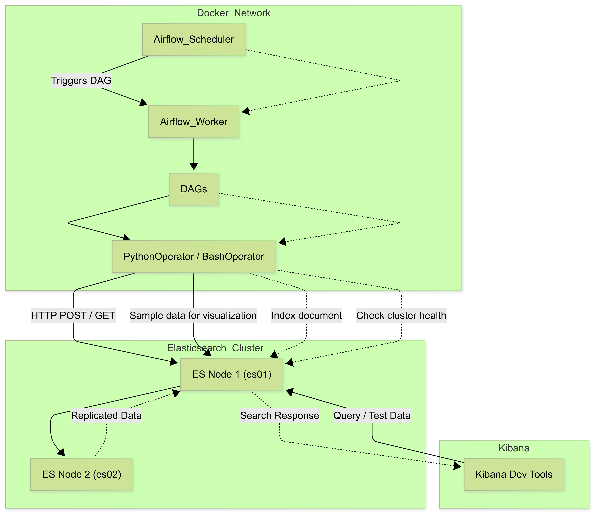
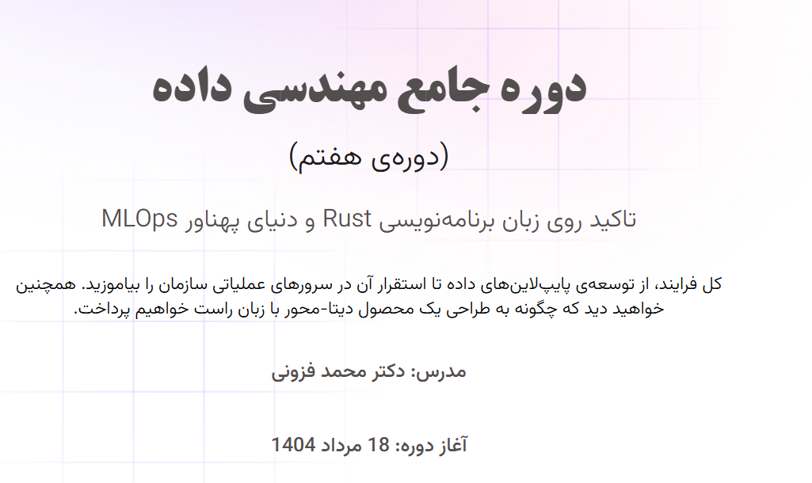

# Airflow & Elasticsearch Integration with Docker Compose

This project demonstrates a fully functional integration of **Apache Airflow 3.0.4** with **Elasticsearch 9.1.2** using Docker Compose, including network linking, plugin configuration, DAGs, and testing with Kibana.

------

## Table of Contents

- [Requirements](https://chatgpt.com/c/68ae3c6b-95b0-8327-a857-254b7dda2716#requirements)
- [Project Structure](https://chatgpt.com/c/68ae3c6b-95b0-8327-a857-254b7dda2716#project-structure)
- [Setup & Docker Compose](https://chatgpt.com/c/68ae3c6b-95b0-8327-a857-254b7dda2716#setup--docker-compose)
- [Elasticsearch Access](https://chatgpt.com/c/68ae3c6b-95b0-8327-a857-254b7dda2716#elasticsearch-access)
- [Kibana Dev Tools Testing](https://chatgpt.com/c/68ae3c6b-95b0-8327-a857-254b7dda2716#kibana-dev-tools-testing)
- [Airflow Connections Configuration](https://chatgpt.com/c/68ae3c6b-95b0-8327-a857-254b7dda2716#airflow-connections-configuration)
- [Plugins Setup](https://chatgpt.com/c/68ae3c6b-95b0-8327-a857-254b7dda2716#plugins-setup)
- [DAG Examples](https://chatgpt.com/c/68ae3c6b-95b0-8327-a857-254b7dda2716#dag-examples)
- [Troubleshooting](https://chatgpt.com/c/68ae3c6b-95b0-8327-a857-254b7dda2716#troubleshooting)

------

## Requirements

- Docker >= 24
- Docker Compose >= 2.20
- Python >= 3.10 (inside containers)

------

## Project Structure

```
Airflow-Link-ELK-Pro/
├── dags/
│   ├── elasticsearch_dag.py
│   ├── kibana_data_pipeline.py
│   └── sample_dag.py
├── plugins/
│   └── elasticsearch_hook.py
├── docker-compose.airflow.yml
├── docker-compose.elasticsearch.yml
├── config/
├── logs/
└── README.md
```

------



## Setup & Docker Compose

1. **Start Elasticsearch & Kibana:**

```bash
docker-compose -f docker-compose.elasticsearch.yml up -d
```

1. **Start Airflow (linked to Elasticsearch via network):**

```bash
docker-compose -f docker-compose.airflow.yml up -d
```

1. **Check running containers:**

```bash
docker ps
```

All services should show `Up (healthy)`:

- `airflow-apiserver`
- `airflow-scheduler`
- `airflow-worker`
- `es01`, `es02`
- `kibana`
- `postgres`, `redis`

------

## Elasticsearch Access

- Test access via **curl**:

```bash
curl -u "elastic:%40Anubis1274" -k https://localhost:9200/
```

- Example output:

```json
{
  "name" : "es01",
  "cluster_name" : "docker-cluster",
  "cluster_uuid" : "...",
  "version" : { "number" : "9.1.2", ... },
  "tagline" : "You Know, for Search"
}
```

> ⚠ Note: `%40` is URL encoding for `@`.

------

## Kibana Dev Tools Testing

1. Open Kibana UI: [http://localhost:5601](http://localhost:5601/)
2. Go to **Dev Tools**
3. Index a sample tweet:

```json
POST /tweets/_doc
{
  "user": "airflow",
  "message": "Testing Elasticsearch from Airflow DAG",
  "timestamp": "2025-08-27T05:00:00Z"
}
```

1. Retrieve the document:

```json
GET /tweets/_search
{
  "query": {
    "match": { "user": "airflow" }
  }
}
```

- You should see the inserted document in the results.

------

## Airflow Connections Configuration

- Inside Airflow container:

```bash
docker exec -it airflow-elk-pro-airflow-apiserver-1 bash
airflow connections list
```

- Example Elasticsearch connection (`elasticsearch_default`):

| conn_id | conn_type     | host | schema | login   | password    | port | extra                                    |
| ------- | ------------- | ---- | ------ | ------- | ----------- | ---- | ---------------------------------------- |
| elastic | elasticsearch | es01 | https  | elastic | @Anubis1274 | 9200 | `{"scheme":"https","verify_cert":false}` |

- To set connection manually:

```bash
airflow connections add \
    --conn_id elasticsearch_default \
    --conn_type elasticsearch \
    --host es01 \
    --schema https \
    --login elastic \
    --password '@Anubis1274' \
    --port 9200 \
    --extra '{"scheme": "https", "verify_cert": false}'
```

------

## Plugins Setup

1. Place your custom hook in `plugins/elasticsearch_hook.py`.
2. Ensure `plugins/__init__.py` exists:

```bash
touch plugins/__init__.py
```

1. Inside your DAG, import:

```python
from elasticsearch_hook import ElasticsearchHook
```

> ⚠ Avoid importing from `plugins.elasticsearch_hook` if you face `ModuleNotFoundError`. Keep hook next to DAG or adjust `PYTHONPATH`.

------

## DAG Examples

### 1. Test Elasticsearch Connection

```python
from airflow import DAG
from airflow.operators.python import PythonOperator
from datetime import datetime, timedelta
import requests
from requests.auth import HTTPBasicAuth

def test_es_conn():
    response = requests.get(
        'http://es01:9200/',
        auth=HTTPBasicAuth('elastic', '@Anubis1274'),
        verify=False
    )
    print(response.json())

with DAG('test_elasticsearch', start_date=datetime(2023,1,1), schedule_interval=timedelta(hours=1), catchup=False) as dag:
    check = PythonOperator(task_id='check_es', python_callable=test_es_conn)
```

### 2. Kibana Data Pipeline

```python
from airflow import DAG
from airflow.operators.python import PythonOperator
from airflow.operators.empty import EmptyOperator
from datetime import datetime, timedelta
import requests, random
from requests.auth import HTTPBasicAuth

def generate_kibana_data():
    doc = {
        "timestamp": datetime.now().isoformat(),
        "value": random.randint(1,100)
    }
    requests.post(
        'http://es01:9200/kibana_sample/_doc',
        auth=HTTPBasicAuth('elastic', '@Anubis1274'),
        json=doc,
        verify=False
    )

with DAG('kibana_data_pipeline', start_date=datetime(2023,1,1), schedule_interval=timedelta(minutes=5), catchup=False) as dag:
    start = EmptyOperator(task_id='start')
    generate = PythonOperator(task_id='generate_data', python_callable=generate_kibana_data)
    end = EmptyOperator(task_id='end')
    start >> generate >> end
```

------

## Troubleshooting

- **ModuleNotFoundError `plugins`**:
   Move custom hook next to DAG or ensure `plugins/__init__.py` exists.
- **Elasticsearch connection errors**:
  - Check container network: `docker network ls` and ensure Airflow & ES on same network
  - Verify credentials (`elastic` / `@Anubis1274`)
- **DAG fails after restart**:
  - Ensure `docker-compose -f docker-compose.airflow.yml restart airflow-apiserver airflow-scheduler` is executed
  - Clear old DAG runs if necessary: `airflow dags clear <dag_id>`

------

## References

- [Airflow 3.0.4 Documentation](https://airflow.apache.org/docs/apache-airflow/stable/index.html)
- [Elasticsearch 9.1 Documentation](https://www.elastic.co/guide/en/elasticsearch/reference/9.1/index.html)
- [Kibana Dev Tools](https://www.elastic.co/guide/en/kibana/current/dev-tools.html)

## Acknoledgment



# Comprehensive Data Engineering Course  
**(7th Edition)**

Focus on the **Rust programming language** and the vast world of **MLOps**.  
Learn the **entire process**, from developing data pipelines to deploying them on operational servers within an organization. You will also explore how to **design a data-driven product** using Rust.

**Instructor:** Dr. Mohammad Fazouni  
**Course Start Date:** August 9, 2025
